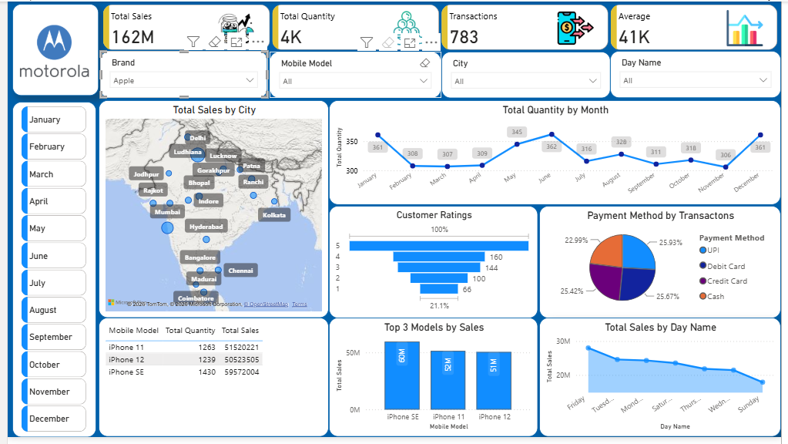

# Mobile Sales Dashboard

A Power BI dashboard I built on a mobile phone sales dataset — around 3,800 transactions spread across Indian cities from late 2021 to late 2024. Wanted to see how the big phone brands stack up against each other, which cities actually drive revenue, and whether customer ratings tell a different story than the sales numbers.

## What it covers

Five brands (Apple, Samsung, OnePlus, Vivo, Xiaomi), 29 cities, ~19,150 units sold, and total revenue of roughly ₹76.9 crore. The page has slicers for Brand, Mobile Model, City, and Day Name, plus a month selector down the side, so you can drill into any single brand or city and everything else updates.

On the report itself: KPI cards up top (total sales, quantity, transactions, average sale), a city map, a month-over-month quantity trend, a ratings breakdown, payment method split, top 3 models, sales by weekday, and a model-level table at the bottom.

## What stood out

Apple comes out on top for revenue but not by much — Samsung and OnePlus are within a few percent of it, so it's not really a one-brand market in this data. Delhi and Mumbai carry a disproportionate chunk of total sales compared to everywhere else, which trail off pretty gradually.

What surprised me a bit is that the top-selling models aren't the flagships — iPhone SE, OnePlus Nord, and Galaxy Note 20 lead by revenue, all of which are mid-range or a generation or two old. Payment methods came out almost perfectly split across UPI, debit, credit, and cash, so there's no clear preference there. Ratings skew pretty positive overall (average 3.7/5, with almost 39% of transactions rated 5 stars), and Saturday/Monday are consistently the strongest sales days while Wednesday lags behind.

One thing worth flagging if you're working with the raw file: the `Day Name` column has a handful of rows using abbreviated day names (`Mon` instead of `Monday`) instead of the full name used everywhere else. Doesn't affect the dashboard as built, but it'll throw off a groupby if you're doing your own analysis on the source data.

## Files

- `Mobile_Sales_Dashboard.pbix` — the Power BI report
- `data/Mobile_Sales_Data.xlsx` — source dataset
- `screenshots/dashboard_overview.png` — full dashboard preview
- `docs/insights.md` — the numbers behind the summary above

## Viewing it

You'll need [Power BI Desktop](https://powerbi.microsoft.com/desktop/) (free) to open the `.pbix` and interact with it directly. If you just want the gist, the screenshot and `docs/insights.md` cover the same ground.

## Built with

Power BI Desktop for the modeling, DAX, and visuals. Source data came in as an Excel export.
